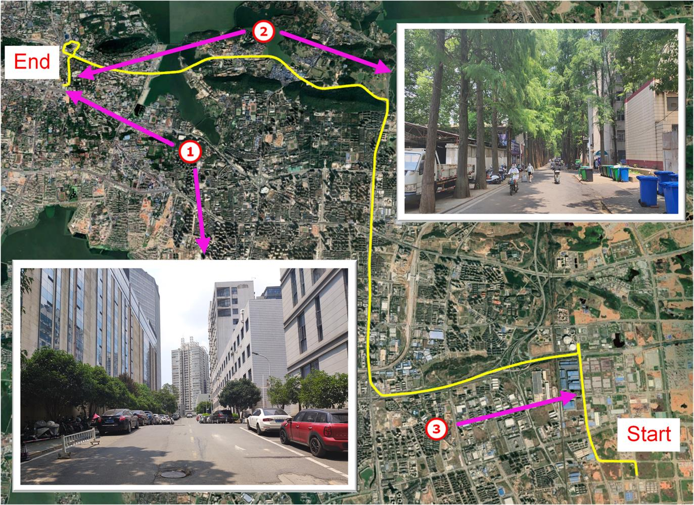
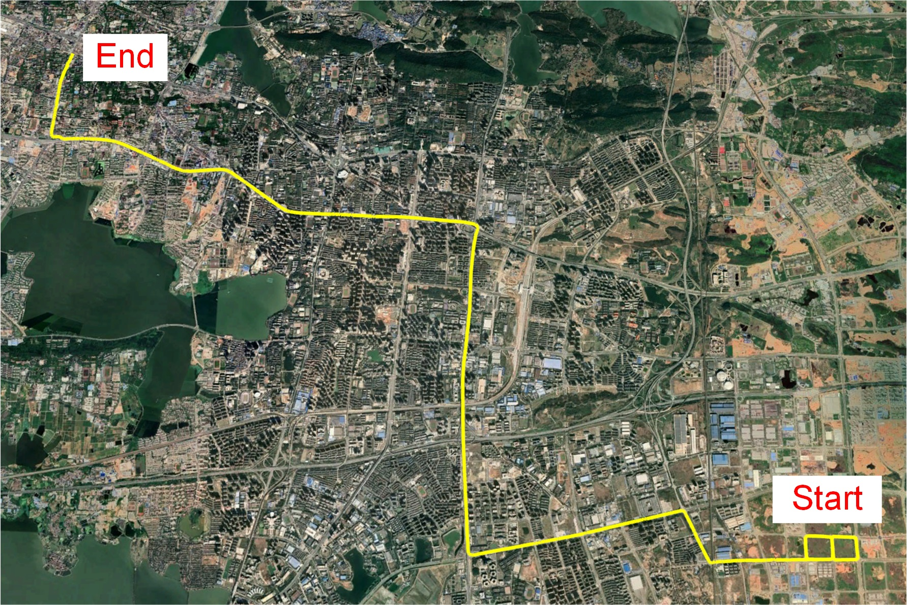

# POSGO

## an open-source software for GNSS pseudorange positioning based on graph optimization


POSGO (POSition based on Graph Optimization) is a multi-frequency and multi-GNSS pseudorange data processing software program based on GO (Graph optimization). The main features of the software are listed in the following:

- Single-Point Positioning (SPP) and Relative Positioning (RP) positioning based on GO
- Support several loss functions for robust estimation in GO
- Support multi-constellation data processing
- Support single-frequency and dual-frequency ionospheric-free SPP
- Support multi-frequency RP

**Authors:** Zhen Li, Jing Guo, and Qile Zhao from the [Satellite POD and Navigation Augmentation Group](http://panda.whu.edu.cn/), Wuhan University.

**Related Paper:**

- Li Z, Guo J, Zhao Q (2022) POSGO: an open-source software for GNSS pseudorange positioning based on graph optimization.

## 1 Prerequisites

### 1.1 System and compiler

We recommend you use Ubuntu 18.04 or Ubuntu 20.04 with the gcc compiler (gcc>=7.5).

### 1.2 Eigen3

```
sudo apt-get install libeigen3-dev
```

### 1.3 Ceres

Follow [Ceres installation instructions](http://ceres-solver.org/installation.html).

## 2 Quick Start

### 2.1 Installation

Once the prerequisites have been installed, you can clone this repository and build POSGO as follows:

```
# Clone the repository
git clone https://github.com/lizhengnss/POSGO.git ~/

# Build POSGO
cd ~/POSGO
mkdir build && cd build
cmake ../ -DCMAKE_BUILD_TYPE=Release
make -j4

# Check if the compilation was successful
./POSGO
```

### 2.2 Data Processing

program arguments need to be given in the following format when the software is running:

```
POSGO -C [config] -S [GREC] -M [ProcessMode] -L [TraceLevel]
```

The program parameters of SPP GOLD in paper are as follows:

```
POSGO -C YOURPATH/conf/spp_kpl_go_ld.ini -S GREC -M SPP -L 1
```

The program parameters of RP GOLD in paper are as follows:
```
POSGO -C YOURPATH/conf/rp_kpl_go_ld.ini -S GREC -M RTK -L 1
```

## 3 Datasets

We offer 3 demo dataset with configuration file, which are located at **data** directory.

### 3.1 KPL Dataset

Kinematic data of urban areas in Wuhan city collected by geodetic receivers during 12:00~12:45 (UTC) on Day of Year (DOY) 165, 2022. Base station and rover GNSS observation are provided. The smoothed RTK solution from the NovAtel Waypoint 8.9 software package is used as the reference.



### 3.2 Huawei P40 Dataset

Kinematic data of urban areas in Wuhan city collected by Huawei P40 mobile phone during 3:35~4:20 (UTC) on Day of Year (DOY) 183, 2022. Base station and rover GNSS observation are provided. We are also equipped with the Leador A15 integrated navigation system, and the smoothed GNSS/INS solution form the GINS is used as the reference.



### 3.3 Huawei Mate20 Dataset

Static data of urban canyon in Wuhan city collected by Huawei Mate20 mobile phone during 6:35~6:50 (UTC) on Day of Year (DOY) 266, 2021. The reference solution is obtained from RTK.

  

## 4 Acknowledgements

We thanks [RTKLIB](https://github.com/tomojitakasu/RTKLIB/tree/rtklib_2.4.3), [RTKLIB-Demo5](https://github.com/rtklibexplorer/RTKLIB), [GraphGNSSLib](https://github.com/weisongwen/GraphGNSSLib) and [OB_GINS](https://github.com/i2Nav-WHU/OB_GINS) for selfless open-source spirit and elegant programming.

At the same time, Shengyi Xu from Wuhan University provided some analysis scripts for POSGO. Xiao Liu, Ziyu Fan, Gaojian Zhang, Yihao Jiang, Hengda Wei and Shengyi Xu from Wuhan University tested the software, we also thank them for their work.

## 5 License

The source code is released under GPLv3 license.

We are still working on improving the code reliability and fix potential bugs. For any technical issues, please contact Zhen Li (sdkjlizhen@foxmail.com) or open an issue at this repository.
